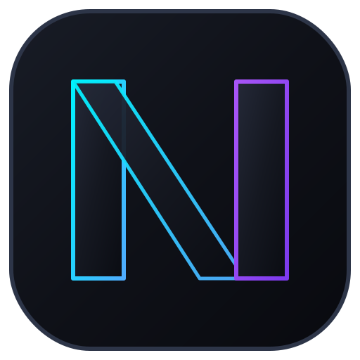

<div align="center">
  
  <h1>NexusSSH - Premium macOS SSH, Serial Console & SFTP Manager</h1>
  <p><b>Trình quản lý kết nối máy chủ SSH, Serial Console (UART/USB) và trình duyệt SFTP cao cấp trên macOS mang phong cách Termius Neon Glassmorphism.</b></p>
</div>

---

## 🌟 Tính Năng Nổi Bật

### 1. Quản Lý Kết Nối Đa Giao Thức (Multi-Protocol)
- **SSH Server**: Kết nối máy chủ Linux/Unix qua thư viện `ssh2` thuần JavaScript (hiệu năng cao, bảo mật tuyệt đối).
- **Serial Console (USB/UART/RS232)**: Tự động quét cáp console, thiết bị USB-to-Serial trên macOS (`/dev/cu.*`, `/dev/tty.*`), tùy chỉnh Baud Rate (`9600`, `115200`, `38400`...), Data Bits, Parity, Stop Bits.
- **Local macOS Terminal**: Mở shell trực tiếp trên máy Mac (`/bin/zsh` hoặc `/bin/bash`).

### 2. Xác Thực Thông Minh & Bảo Mật Chuẩn AES-256-GCM
- **Lưu trữ mật khẩu mã hóa (Encrypted Password Storage)**: Toàn bộ mật khẩu và passphrase được mã hóa theo chuẩn **AES-256-GCM** với khóa riêng tư lưu tại `~/.nexusssh/secret.key`.
- **Hộp thoại Chuyển đổi Xác thực Động (Dynamic Auth Fallback)**: Khi kết nối SSH thất bại do sai mật khẩu hoặc khóa SSH cũ, ứng dụng hiển thị popup cho phép chuyển đổi giữa **Nhập Mật Khẩu** hoặc **Chọn Khóa SSH Khác** từ `~/.ssh` và thử lại ngay lập tức không cần đóng tab.

### 3. Terminal Tương Tác Đa Tab (`xterm.js`) & Tự Động Co Giãn Màn Hình
- **Tự động nhận diện màn hình**: Khi khởi động, cửa sổ tự động đo kích thước màn hình làm việc để mở tỷ lệ chuẩn 88% vừa vặn.
- **Đồng bộ kích thước động (Dynamic PTY Auto-Resize)**: Nhận diện thay đổi kích thước cửa sổ theo thời gian thực và gửi tín hiệu `SIGWINCH` tới máy chủ, giúp các ứng dụng full-screen như **`htop`**, **`vim`**, **`nano`**, **`less`** luôn tràn màn hình hoàn hảo.
- **4 bộ Theme cao cấp**: **Termius Dark**, **Cyberpunk Neon**, **Dracula**, **Nord**.

### 4. Trình Duyệt File SFTP & Quản Lý Lệnh Nhanh
- Duyệt, chỉnh sửa, tải xuống/tải lên tệp tin từ xa qua SFTP được tích hợp sẵn.
- **Run Snippet**: Lưu trữ và thực thi nhanh các lệnh DevOps (`htop`, `docker ps`, `show running-config`...).
- **Nhập tự động cấu hình từ `~/.ssh/config`** chỉ với 1 cú nhấp chuột.

---

## 🚀 Hướng Dẫn Khởi Chạy (Chế Độ Phát Triển - Dev Mode)

### 1. Cài đặt các gói phụ thuộc
```bash
npm install
```

### 2. Khởi chạy ứng dụng Desktop native (Electron)
```bash
npm run electron
```
*Lệnh này sẽ khởi chạy đồng thời Backend Server (Port 4000), Vite Frontend Dev Server (Port 5173) và cửa sổ Electron native.*

### 3. Khởi chạy chế độ Web App trên trình duyệt
```bash
npm run dev
```
Sau đó mở trình duyệt tại đường dẫn: **`http://localhost:5173`**

---

## 📦 Hướng Dẫn Đóng Gói & Build Bộ Cài (Production Build Guide)

NexusSSH sử dụng **`electron-builder`** để tạo bộ cài đặt chuyên nghiệp, độc lập không cần phụ thuộc vào Node.js hay Terminal. Toàn bộ tài nguyên frontend được biên dịch tĩnh với đường dẫn tương đối (`base: './'`).

### 1. Đóng gói cho macOS (Hỗ trợ cả Apple Silicon ARM64 & Intel x64)
```bash
npm run dist:mac
```
**Kết quả đầu ra (trong thư mục `release/`):**
- **`release/NexusSSH-1.0.0-arm64.dmg`**: Bộ cài cho Apple Silicon (M1/M2/M3/M4).
- **`release/NexusSSH-1.0.0-x64.dmg`**: Bộ cài cho máy Mac dùng chip Intel x64.

### 2. Đóng gói cho Windows (Hỗ trợ cả Windows x64 phổ biến & Windows ARM64)
- **Đóng gói đồng thời cả Windows x64 (Intel/AMD) và ARM64:**
```bash
npm run dist:win
```
- **Chỉ đóng gói cho máy tính Windows x64 thông thường (khuyên dùng nếu build nhanh):**
```bash
npm run dist:win:x64
```
**Kết quả đầu ra (trong thư mục `release/`):**
- **`release/NexusSSH Setup 1.0.0.exe`** (Bộ cài NSIS Setup cho Windows x64/ARM64).

### 3. Đóng gói cho Linux (.AppImage & .deb)
```bash
npm run dist:linux
```

---

## 📁 Cấu Trúc Mã Nguồn

```
nexus-ssh/
├── package.json               # Cấu hình script khởi chạy & đóng gói electron-builder
├── electron-main.js           # Wrapper Electron quản lý cửa sổ & backend embedded
├── server/                    # Backend API & Socket.IO realtime server
│   ├── server.js              # Express & Socket.IO server (Port 4000)
│   ├── sshManager.js          # Quản lý luồng kết nối SSH & Auto-Resize PTY
│   ├── serialManager.js       # Quản lý & tự động quét cổng Serial macOS
│   ├── localPtyManager.js     # Quản lý shell nội bộ macOS
│   ├── sftpManager.js         # Quản lý thao tác file SFTP
│   ├── cryptoUtil.js          # Mã hóa / giải mã AES-256-GCM mật khẩu
│   └── dataStore.js           # Lưu trữ danh sách kết nối (~/.nexusssh)
└── client/                    # Frontend React 18 + Vite + xterm.js
    ├── public/
    │   └── icon.svg           # Biểu tượng ứng dụng chuẩn macOS Squircle Neon
    ├── src/
    │   ├── components/        # HostList, TerminalTab, SftpBrowser, SerialScannerModal...
    │   └── index.css          # Design system Dark Glassmorphism
```

---

## 🔒 Dữ Liệu & Bảo Mật
Toàn bộ danh sách kết nối và cấu hình được lưu trữ tại thư mục cá nhân của người dùng trên macOS:
- **Cấu hình máy chủ**: `~/.nexusssh/connections.json`
- **Khóa bí mật mã hóa (AES-256)**: `~/.nexusssh/secret.key`
